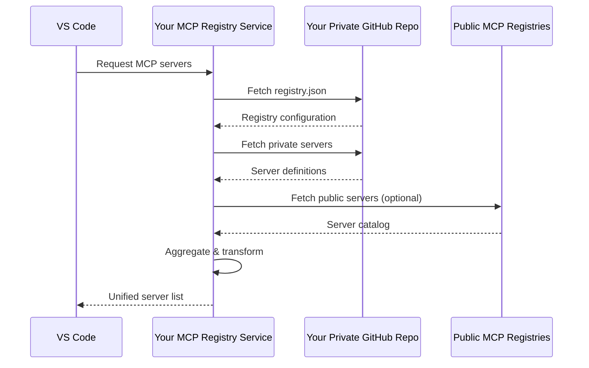

<p align="center">
  
</p>

<h1 align="center">MCP Sub-Registry</h1>

<p align="center">
  <strong>Your own Unified MCP Marketplace — self-hosted, GitOps-driven, and IDE-ready.</strong>
</p>

<p align="center">
  <a href="https://github.com/mcp-reg/mcp-sub-registry/actions/workflows/ci.yml"></a>
  <a href="https://go.dev/"></a>
  <a href="LICENSE"></a>
  <a href="https://mcp-reg.com"></a>
</p>

---

MCP Sub-Registry is an open-source aggregation layer that allows you to build a custom Unified MCP Marketplace from the growing universe of MCP servers. It syncs with public registries, lets you add your own private/custom servers, and exposes everything through a single Marketplace UI and the official [MCP Registry API](https://modelcontextprotocol.io/registry/about).

## Why?

The MCP ecosystem is growing fast. Public registries from [modelcontexprotocol.io](https://registry.modelcontextprotocol.io/), [GitHub](https://github.com/mcp), [Microsoft](https://mcp.azure.com/), and others each host their own catalogs of MCP servers. But if you're an organization, you face a fragmented landscape:

- **Fragmentation**: servers are scattered across multiple public registries.
- **Private MCP Servers**: you have private, internal MCP servers that can't live on public registries.
- **No curation**: you want your team to see the right servers, not all 2,000+ of them.
- **No single pane of glass**: switching between registries to find what you need is a time sink
- **Control**: you need control over what your team can see and use — not a free-for-all.

## The Solution

**MCP Sub-Registry** is a self-hosted aggregation layer that sits between public MCP registries and your developer tools. A single gateway that pulls from any combination of public registries, merges in your private/custom servers, and exposes everything through one unified Marketplace UI and [MCP Registry API](https://registry.modelcontextprotocol.io/docs).

### Try it Free

Don't need a private registry? Or just want to create a public sub-registry (Marketplace UI + API) with your curated list of MCP servers for your team. Use our free hosted service at **[mcp-reg.com](https://mcp-reg.com)** to browse and connect to public MCP Sub-Registries.

See a demo at: **[mcp-reg.com/mcp-reg/demo](https://mcp-reg.com/mcp-reg/demo)**.

### Key Capabilities

- **Aggregate** servers from The Official MCP Registry, GitHub, Microsoft, and any other public MCP registry which implements the [Official MCP Registry API](https://registry.modelcontextprotocol.io/docs) into one catalog
- **Add private servers** that only your organization can access — defined in your own GitHub repo
- **Curate and control** exactly which servers are available to your team
- **IDE Support** through a single, standards-compliant API endpoint. Supported IDEs include VS Code and Visual Studio. See supported IDEs [here](https://docs.github.com/en/copilot/how-tos/administer-copilot/manage-mcp-usage/configure-mcp-registry#support-for-the-v01-specification).
- **Deploy anywhere** as a single binary with an embedded web UI
- **Stay in sync** with GitOps — your registry config lives in version control

### Self Host and Private

Use this open-source project to **self-host** and connect to your own **private registry repository** and manage your sub-registry through a private GitOps enabled repository.

---

## How It Works



1. **You define** a `registry.json` in your private GitHub repo — listing which public registries to pull from and which private servers to include
2. **Your IDE requests** servers from your MCP Sub-Registry
3. **The service fetches** from each configured source — public registries and private paths
4. **Aggregates and transforms** all servers into a single, normalized catalog
5. **Returns** the unified server list to the IDE, ready to use

---

## Quick Start

### Install

```bash
curl -fsSL https://raw.githubusercontent.com/mcp-reg/mcp-sub-registry/main/scripts/install.sh | bash
```

### Run the Server

```bash
mcp-registry
```

Then open http://localhost:8080 in your browser.

### With GitHub Token (for Private Repos)

```bash
GITHUB_TOKEN=your_token mcp-registry
```

### Setup your Git Configuration Repo

* Fork or Clone the template repo at: https://github.com/mcp-reg/mcp-registry-template . Press the [Use this template](https://github.com/new?template_name=mcp-registry-template&template_owner=mcp-reg) in the Github UI.
* You now have an MCP Sub-Registry configured with a basic configuration.
* Access the Marketplace UI via your server for the repo you created at: `http://localhost:8080/<your org>/<your repo name>`
* Follow instructions at https://github.com/mcp-reg/mcp-registry-template (or at your new repo README.md) for further customizaiton of you new MCP Sub-Registry.

### Deploy Your Server
* Depoly to your favorite platform: Lambda, GCP Cloud Run, Kubernetes. Single binary deployment in your prefered container.
* Provide your public URL to your team: `https://<your domain>/<your org>/<your repo name>`.

### Configure VS Code / Visual Studio
* Follow the instructions at: https://docs.github.com/en/copilot/how-tos/administer-copilot/manage-mcp-usage/configure-mcp-server-access on how to configure an MCP registry URL which will be used across your organization for VS Code and/or Visual Studio. Use the url: `https://<your domain>/<your org>/<your repo name>`. If you want a specific branch other than `main` you can also configure: `https://<your domain>/<your org>/<your repo name>/<branch name> `.
* **Note**: This configuration requires that your server url is open to the public.

---

## Server Configuration

| Variable            | Default                  | Description                                       |
| ------------------- | ------------------------ | ------------------------------------------------- |
| `PORT`              | `8080`                   | Server port                                       |
| `GITHUB_TOKEN`      | none                     | GitHub auth token (required for private repos, recommended for public repos to avoid API rate limits) |
| `GITHUB_API_BASE`   | `https://api.github.com` | GitHub API URL (for GitHub Enterprise)            |
| `CACHE_TTL`         | `1h`                     | Cache TTL for registry data                       |
| `CACHE_ENABLED`     | `true`                   | Enable/disable caching                            |
| `BROWSER_CACHE_TTL` | `5m`                     | HTTP Cache-Control header TTL                     |

See [`.env.example`](.env.example) for all available environment variables.

---

## API Reference

| Endpoint                                                            | Description          |
| ------------------------------------------------------------------- | -------------------- |
| `GET /health`                                                       | Health check         |
| `GET /{org}/{repo}/{branch}/v0.1/servers`                           | List all servers     |
| `GET /{org}/{repo}/{branch}/v0.1/servers?search=name`               | Search servers       |
| `GET /{org}/{repo}/{branch}/v0.1/servers/{name}/versions/latest`    | Get latest version   |
| `GET /{org}/{repo}/{branch}/v0.1/servers/{name}/versions/{version}` | Get specific version |
| `POST /{org}/{repo}/{branch}/v0.1/refresh`                          | Invalidate cache     |

---

## Development

See [CONTRIBUTING.md](CONTRIBUTING.md) for more details.

---

## License

MIT License - see [LICENSE](LICENSE) for details.

---

<p align="center">
  <a href="https://mcp-reg.com">mcp-reg.com</a> ·
  <a href="https://github.com/mcp-reg/mcp-sub-registry/issues">Issues</a>   
</p>
